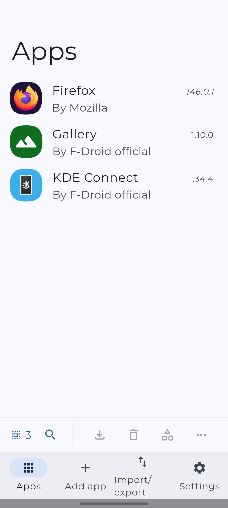
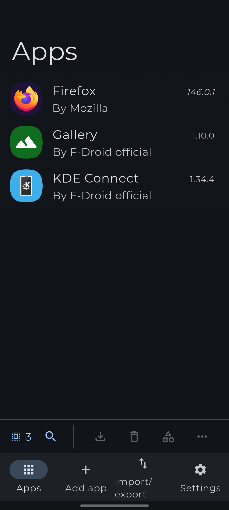
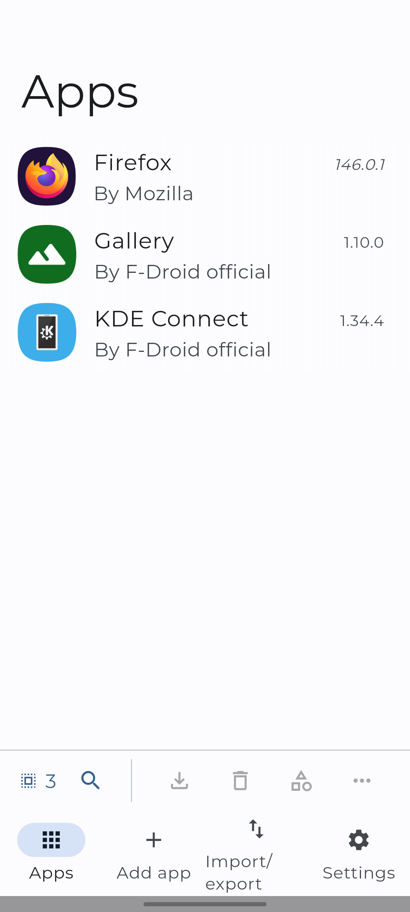
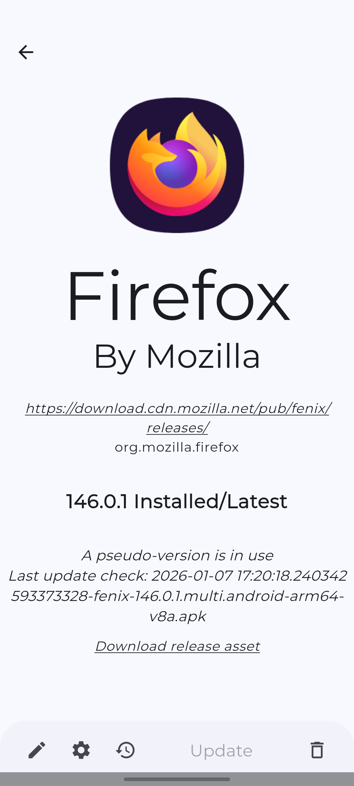

#  Updatium

Update your Android apps directly from the APK source. Forked from [Obtainium](https://github.com/ImranR98/Obtainium) due to the developer's problematic political views and his terrible behaviour toward Jews who wanted to contribute to his app.

Updatium allows you to install and update apps directly from their releases pages, and receive notifications when new releases are made available.

Currently supported App sources:
- Open Source - General:
  - [GitHub](https://github.com/)
  - [GitLab](https://gitlab.com/)
  - [Forgejo](https://forgejo.org/) ([Codeberg](https://codeberg.org/))
  - [F-Droid](https://f-droid.org/)
  - Third Party F-Droid Repos
  - [IzzyOnDroid](https://android.izzysoft.de/)
  - [SourceHut](https://git.sr.ht/)
- Other - General:
  - [APKPure](https://apkpure.net/)
  - [Aptoide](https://aptoide.com/)
  - [Uptodown](https://uptodown.com/)
  - [Huawei AppGallery](https://appgallery.huawei.com/)
  - [Tencent App Store](https://sj.qq.com/)
  - [CoolApk](https://coolapk.com/)
  - [vivo App Store (CN)](https://h5.appstore.vivo.com.cn/)
  - [RuStore](https://rustore.ru/)
  - [Farsroid](https://www.farsroid.com)
  - Jenkins Jobs
  - [APKMirror](https://apkmirror.com/) (Track-Only)
- Other - App-Specific:
  - [Telegram App](https://telegram.org/)
  - [Neutron Code](https://neutroncode.com/)
- Direct APK Link
- "HTML" (Fallback): Any other URL that returns an HTML page with links to APK files
## Download

## Limitations
- For some sources, data is gathered using Web scraping and can easily break due to changes in website design. In such cases, more reliable methods may be unavailable.

## Screenshots

|  |            |     |
| ------------------------------------------------------ | ----------------------------------------------------------------------- | -------------------------------------------------------------------- |
|    |  |  |
